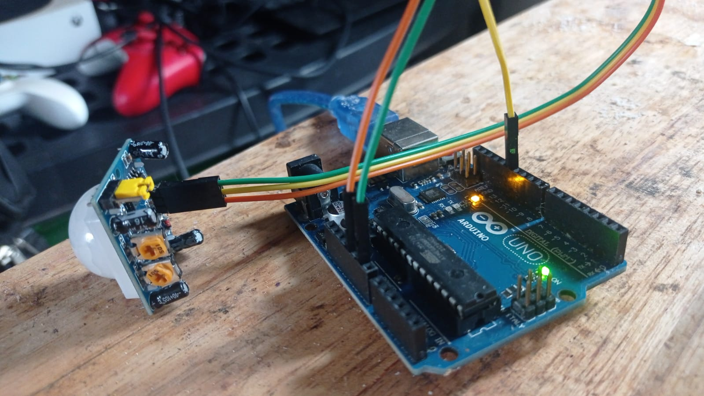

# Arduino Trail Camera - CLI & Sensor Interface

This repository contains the command-line interface (CLI) and Arduino sketch responsible for detecting motion, capturing images/video, and uploading them to the [Arduino Trail Camera API Backend](https://github.com/voscarmv/arduino_trailcam_api). It acts as the bridge between the physical hardware (Arduino, HC-SR501 motion sensor, USB webcam) and the cloud-based backend.


*(Image shows an Arduino Uno connected to an HC-SR501 PIR motion sensor.)*

## Overview

The system uses an Arduino Uno and an HC-SR501 PIR motion sensor to detect movement. When motion is detected, the Arduino signals a connected computer (e.g., a Raspberry Pi or any Linux box). A listener script (`listener.sh`) on this computer then uses `ffmpeg` to capture an image or video from a connected USB webcam. Subsequently, a Node.js script (`signup.sh` for initial setup, and likely another script for uploads, e.g., `upload.js` as per `package.json`) handles the authentication and uploads the captured media to the backend API.

## Core Components

*   **Arduino Sketch (`sketch_apr15a.ino`):**
    *   Monitors the HC-SR501 PIR motion sensor connected to digital pin 12.
    *   When motion is detected, it sends a "Movement detected" message via the serial port (`/dev/ttyACM0` or similar).
    *   Enters a "standby" mode to prevent continuous triggering while the computer processes the capture.
    *   Waits for a toggle byte (defined as `1`) from the computer via serial to resume motion detection.
*   **Listener Script (`listener.sh` - *behavior inferred*):**
    *   Continuously monitors the serial port connected to the Arduino.
    *   Upon receiving the "Movement detected" signal:
        *   Triggers `ffmpeg` to capture an image or video from the connected USB webcam.
        *   Saves the captured media locally.
        *   Likely calls a Node.js script to upload the media to the backend API.
        *   Sends the toggle byte back to the Arduino to re-enable motion detection.
*   **Node.js Scripts:**
    *   `signup.sh` (likely `node signup.js` internally): Handles initial user account creation or login with the backend API.
    *   `upload.js` (inferred from `package.json` "main" entry):
        *   Authenticates with the backend API using credentials from the `.env` file.
        *   Uploads the captured media (image/video) to the backend API, which then likely stores it on Cloudinary.
*   **Environment Configuration (`.env`):**
    *   Stores sensitive information like API endpoint URLs, device identifiers, admin/user credentials for API authentication, and potentially ffmpeg/camera settings.

## System Flow

1.  The HC-SR501 sensor detects motion.
2.  The Arduino sketch reads the HIGH signal from the sensor.
3.  The Arduino sends "Movement detected" over serial to the connected computer and enters standby.
4.  The `listener.sh` script on the computer detects this serial message.
5.  `listener.sh` executes an `ffmpeg` command to capture an image/video from the USB webcam.
6.  The captured media is saved locally.
7.  `listener.sh` invokes a Node.js script (e.g., `upload.js`).
8.  The Node.js script reads API credentials from `.env`, authenticates, and uploads the media to the backend API.
9.  `listener.sh` sends a toggle byte back to the Arduino to re-enable motion detection.

## Hardware Requirements

*   Arduino Uno (or compatible board)
*   HC-SR501 PIR Motion Sensor
*   USB Webcam compatible with `ffmpeg` on Linux
*   A computer capable of running Linux, Node.js, and `ffmpeg` (e.g., Raspberry Pi, an old laptop, a small form-factor PC).
*   Jumper wires for connecting the sensor to the Arduino.

## Software Requirements

*   Linux operating system on the host computer
*   [Node.js](https://nodejs.org/) (version compatible with dependencies in `package.json`)
*   [npm](https://www.npmjs.com/)
*   `ffmpeg` installed and accessible in the system PATH
*   Arduino IDE or `arduino-cli` for uploading the sketch to the Arduino board.
*   Access to the [Arduino Trail Camera API Backend](https://github.com/voscarmv/arduino_trailcam_api).

## Setup & Installation

1.  **Hardware Setup:**
    *   Connect the HC-SR501 sensor to the Arduino Uno as per the circuit diagram:
        *   VCC (Sensor) to 5V (Arduino)
        *   GND (Sensor) to GND (Arduino)
        *   OUT (Sensor) to Digital Pin 12 (Arduino)
    *   Connect the Arduino Uno to the host computer via USB.
    *   Connect the USB webcam to the host computer.
    *   Identify the serial port for the Arduino (e.g., `/dev/ttyACM0` or `/dev/ttyUSB0`). You might need to adjust this in `listener.sh`.
    *   Identify the device path for your USB webcam (e.g., `/dev/video0`). You will need this for `ffmpeg` commands in `listener.sh`.

2.  **Arduino Sketch Upload:**
    *   Open `sketch_apr15a.ino` in the Arduino IDE or use `arduino-cli`.
    *   Select the correct board (Arduino Uno) and port.
    *   Upload the sketch to the Arduino.

3.  **Host Computer Setup:**
    *   Clone this repository:
        ```bash
        git clone https://github.com/your-username/arduino_trailcam_cli-main.git
        cd arduino_trailcam_cli-main
        ```
    *   Install Node.js dependencies:
        ```bash
        npm install
        ```
    *   Ensure `ffmpeg` is installed. On Debian/Ubuntu based systems:
        ```bash
        sudo apt update
        sudo apt install ffmpeg
        ```
    *   Create and configure the `.env` file:
        ```bash
        cp .env.example .env # if an example is provided, otherwise touch .env
        nano .env
        ```
        Populate it with the necessary variables:
        ```env
        API_BASE_URL="http://your-api-backend-url.com" # e.g., http://localhost:3000 if running API locally
        ADMIN_EMAIL="your_admin_email_for_api@example.com"
        ADMIN_PASSWORD="your_admin_password_for_api"
        # Potentially other user credentials if signup.sh is for a specific device user
        DEVICE_SERIAL_PORT="/dev/ttyACM0" # Adjust if your Arduino is on a different port
        WEBCAM_DEVICE="/dev/video0"      # Adjust if your webcam is on a different port
        # Add any other settings required by listener.sh or upload.js
        ```

4.  **Initial API Account Setup (if needed):**
    The `signup.js` script is used for creating an account on the backend API.
    ```bash
    node signup.js # Or as specified if it's a shell script directly
    ```
    *Note: This step is needed once if you need to register this specific trail camera client as a user/device on the API.*

5.  **Start the Listener:**
    Make the listener script executable and run it:
    ```bash
    chmod +x listener.sh
    ./listener.sh
    ```
    This script will now listen for signals from the Arduino and trigger captures/uploads.

## Scripts

*   **`sketch_apr15a.ino`:** Arduino code for motion detection and serial communication.
*   **`listener.sh`:** The Arduino circuit signals this script which takes the picture and uploads it.
*   **`signup.sh` / `signup.js` (Inferred):** A Node.js script to register/login this client device with the backend API.
*   **`upload.js`:** A Node.js script that takes a file path as an argument, authenticates with the API using credentials from `.env`, and uploads the file. It would use `node-fetch` and `form-data` as per `package.json`.

## Related Repositories

*   **API Backend:** [arduino_trailcam_api](https://github.com/voscarmv/arduino_trailcam_api)
*   **API Tester (Frontend/Client Example):** [arduino_trailcam_api_tester](https://github.com/voscarmv/arduino_trailcam_api_tester)
*   **Web Frontend:** [arduino_trailcam_frontend-main](<link-to-your-frontend-repo-if-public>)

## Troubleshooting

*   **Serial Port Permissions:** You might need to add your user to the `dialout` group (or similar, depending on your Linux distribution) to access the serial port without `sudo`: `sudo usermod -a -G dialout $USER`. You'll need to log out and log back in for this to take effect.
*   **Webcam Access:** Ensure `ffmpeg` can access your webcam. Test with a simple `ffmpeg -i /dev/video0 -frames:v 1 test.jpg` command.
*   **API Connectivity:** Verify the `API_BASE_URL` in your `.env` file is correct and the API backend is running and accessible.
*   **Credentials:** Double-check the API credentials in the `.env` file.

## Future Enhancements

*   More robust error handling in `listener.sh` and Node.js scripts.
*   Configuration options for capture duration, resolution, and frequency.
*   Timestamping or watermarking images/videos directly via `ffmpeg`.
*   Local storage queue for uploads in case of network unavailability.
*   Secure storage of API credentials.